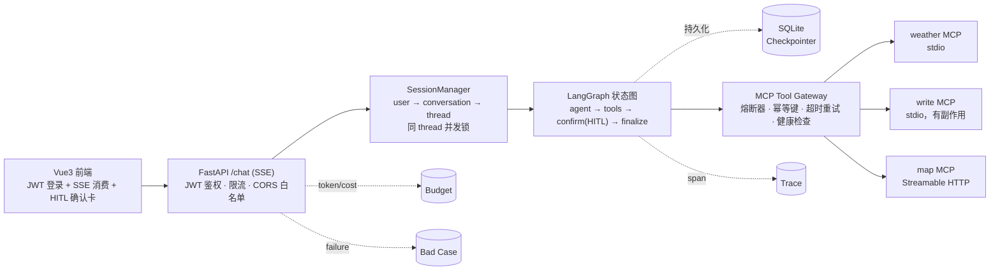

# MCP Multi-Tool Agent

[](https://github.com/z8ri/mcp-multi-tool-agent/actions/workflows/ci.yml)

多数教学/demo 级别的 Agent 项目要么把控制流整个交给框架自带的 `create_react_agent`，工具调用失败、并发写检查点冲突、副作用操作要不要人工确认这些工程问题基本不处理；要么反过来堆一堆没有真实验证过的功能点，"看起来"完整。这个项目走的是另一条路：一个从零手写的 LangGraph 状态图（`agent` / `tools` / `confirm` / `finalize` 四个节点 + 条件边），前面接一个带熔断器、健康检查、幂等键、超时重试的 MCP Tool Gateway，支持多用户会话隔离、可从进程重启中恢复的对话状态，以及写文件这类有副作用操作的真实人工确认——HITL 在这里不是设计图上的一个词，图会真的暂停执行，等一次 API 调用把它批准或者拒绝。每一项都有对应的自动化测试或者一次真实的手工验证，记录在 [docs/ENGINEERING_NOTES.md](docs/ENGINEERING_NOTES.md)。

## 工作原理



`thread_id` 全程只存在于服务端（`SessionManager` 维护 `conversation_id → thread_id` 的映射），前端只知道 `conversation_id`，拿不到也改不了 LangGraph 的 thread 标识。写文件这类有副作用的工具调用会让图在 `confirm` 节点真正 `interrupt()`，客户端提交 `confirm: true/false` 之后才 `resume`——中间如果进程重启，SQLite Checkpointer 能把暂停状态原样恢复。

- **自定义 LangGraph 状态图**（不是预构建 `create_react_agent`），显式区分 agent / tools / confirm(HITL) / finalize 节点
- **MCP Tool Gateway**：allowlist、超时、重试、熔断、健康检查、幂等键、单 Server 故障隔离——一个 MCP 连接异常不会清空整个工具列表
- **真实多用户会话隔离**：JWT 登录 + SessionManager（user → conversation → LangGraph thread）+ 同 thread 并发锁
- **SQLite Checkpointer**（跨重启恢复），而不是进程内 `InMemorySaver`
- **SSE 按图的执行步骤增量推送**（工具调用、确认请求、工具结果、最终消息），不是等全部跑完才一次性返回一个 JSON
- **`MOCK_MODE=true` 时用关键词触发的假模型驱动真实的 MCP Gateway/Server**，不需要任何 API Key 就能把整条链路（注册登录 → 建会话 → 聊天 → 工具调用 → HITL 确认 → 写文件）跑通
- **自建免 Key 地图 MCP Server**（基于 OpenStreetMap Nominatim，Streamable HTTP）
- **结构化 Trace**：每次模型调用、每次工具调用都落一条 span（耗时、成功/失败），`GET /conversations/{id}/trace` 能按时间顺序查一次对话的完整轨迹
- **Eval 回归套件**（`backend/eval/`）：5 个脚本化场景，`MOCK_MODE` 下不需要任何 Key 就能跑，`python -m eval.runner` 单独跑出报告，也接进了 `pytest`
- **成本预算**：按用户累计通义千问 token 花费，超预算 `/chat` 会用 402 拦住；`GET /budget` 查当前用量
- **Bad Case 收集**：eval 跑失败的场景、`/chat` 里真实出现的 error，都汇总进同一张表，`GET /bad-cases` 能查
- **CI**：GitHub Actions 跑后端 `pytest`（带覆盖率报告）+ Alembic 迁移校验 + 前端类型检查/构建，不需要真实 API Key
- **业务数据库（User/Conversation）接了 Alembic 版本化迁移**；`trace_spans`/`idempotency_keys`/`bad_cases` 这类独立日志表启动时会做一次轻量数据保留清理，不会无限增长

## 目录结构

```
backend/        FastAPI 应用、Agent Harness、MCP Gateway、鉴权、数据库模型
mcp_servers/    独立的 MCP Server 进程（weather / write / map）
frontend/       Vue3 前端
ops/            Docker Compose 与部署配置
docs/           实现状态、工程笔记
```

## 状态

后端、前端、Trace/Eval、Docker 部署都已经写完并真实验证过（不只是代码走查——每一项具体怎么验证的，见 [docs/ENGINEERING_NOTES.md](docs/ENGINEERING_NOTES.md)）。还剩几件事列在那份文档的"下一步"里。

## 环境要求

- **Python 3.11+**（`mcp`、`langgraph-checkpoint-sqlite` 等依赖要求 3.10+）。
- **Node.js 18+**。

## 快速开始

```bash
conda create -n mcp-agent python=3.11
conda activate mcp-agent

pip install -r backend/requirements.txt
cp .env.example .env   # MOCK_MODE=true（默认值）时不需要填任何 Key

pytest   # 跑 backend/tests 和 mcp_servers/tests
```

`pytest.ini` 接了 `pytest-cov`，每次跑 `pytest` 都会带一份 `backend/app` 的行覆盖率报告；目前是 72 个用例、94% 行覆盖率（`mcp_servers/*` 是独立子进程，跨进程边界 coverage.py 量不到，不算在这个数字里）。

### 持续集成

`.github/workflows/ci.yml` 会在 push/PR 时跑一遍后端 `pytest`（含上面那份覆盖率报告）、Alembic 基线迁移的 upgrade/downgrade、前端 `vue-tsc` 类型检查 + `vite build`——都不需要真实 API Key，结果见仓库的 [Actions 页面](https://github.com/z8ri/mcp-multi-tool-agent/actions)。

### 起后端、用 mock 模式试一遍完整链路（不需要任何 API Key）

```bash
cd backend
uvicorn app.main:app --reload
```

另开一个终端：

```bash
# 注册并拿到 token
TOKEN=$(curl -s -X POST localhost:8000/auth/register \
  -H 'Content-Type: application/json' \
  -d '{"email":"me@example.com","password":"correct horse battery staple"}' | python3 -c 'import sys,json;print(json.load(sys.stdin)["access_token"])')

# 建一个会话
CONV_ID=$(curl -s -X POST localhost:8000/conversations \
  -H "Authorization: Bearer $TOKEN" -H 'Content-Type: application/json' \
  -d '{"title":"demo"}' | python3 -c 'import sys,json;print(json.load(sys.stdin)["id"])')

# 聊天（SSE），mock 模式下发"写"相关的话会触发写文件工具、需要走确认
curl -N -X POST localhost:8000/chat \
  -H "Authorization: Bearer $TOKEN" -H 'Content-Type: application/json' \
  -d "{\"conversation_id\": $CONV_ID, \"message\": \"帮我写一个笔记\"}"

# 上面那次会在 confirm_required 事件处结束；批准执行：
curl -N -X POST localhost:8000/chat \
  -H "Authorization: Bearer $TOKEN" -H 'Content-Type: application/json' \
  -d "{\"conversation_id\": $CONV_ID, \"confirm\": true}"
```

`MOCK_MODE=false` 并填好 `DASHSCOPE_API_KEY` 之后，同一套 API 会换成真实调用通义千问；天气/地图工具本身默认不需要额外 Key（地图走自建的 Nominatim Server，天气没配 `OPENWEATHER_API_KEY` 时会返回结构化的"未配置"错误而不是崩溃）。`QWEN_MODEL` 要填经典命名（默认值 `qwen-plus`）——阿里云百炼控制台"免费额度"页面里那些版本号式的模型名（比如 `qwen3.8-flash`）是给别的接口用的，直接填给这里会报 `400 InvalidParameter: url error`。这一整条链路（真实 Qwen 推理 + 真实工具调用 + HITL + 真实写文件）已经用真实 Key 验证过，见 `docs/ENGINEERING_NOTES.md`。

### 查一次对话的 Trace

```bash
curl -s localhost:8000/conversations/$CONV_ID/trace -H "Authorization: Bearer $TOKEN" | python3 -m json.tool
```

### 查预算用量 / Bad Case

```bash
curl -s localhost:8000/budget -H "Authorization: Bearer $TOKEN" | python3 -m json.tool
curl -s localhost:8000/bad-cases -H "Authorization: Bearer $TOKEN" | python3 -m json.tool
```

### 跑 Eval 回归套件

```bash
cd backend
python -m eval.runner
```

## 前端

后端起好之后（见上面），另开一个终端：

```bash
cd frontend
npm install
cp .env.example .env   # VITE_API_BASE_URL 指向后端，默认 http://localhost:8000
npm run dev
```

浏览器打开 `http://localhost:5173`，注册一个账号，新建对话，跟它说"今天天气怎么样"或者"帮我写一个笔记"就能看到工具调用、HITL 确认卡、分级错误+重试这些效果。详见 [frontend/README.md](frontend/README.md)；端到端测试见 [frontend/e2e/README.md](frontend/e2e/README.md)。

## Docker 部署

一键起全栈（`map-mcp` + `backend` + `frontend`，`backend` 内部再拉起 `weather`/`write` 两个 stdio 子进程）：

```bash
cp .env.example .env   # MOCK_MODE=true 不需要填任何 Key
docker compose -f ops/docker-compose.yml up --build
```

起来之后：前端 `http://localhost:5173`，后端 `http://localhost:8000`，地图 MCP Server（Streamable HTTP）`http://localhost:8811/mcp`。`backend` 会等 `map-mcp` 健康检查通过、`frontend` 会等 `backend` 健康检查通过才启动，验证的是"单 Server 故障不拖垮整体"这条在容器编排层面也成立。

`backend-data`/`backend-output` 是具名 volume，装的是 SQLite 数据库文件和 `write_file` 落盘的内容，`docker compose down` 不会删，`docker compose down -v` 才会。

`docker compose up -d --build` 已经真实跑通过：三个容器按顺序变 healthy，`/readyz` 里 `map`/`weather`/`write` 三个工具都可用，`map.geocode` 真的查到了 Nominatim 的数据，浏览器打开前端也真的连上了容器里的后端。过程中修了两个只有在干净容器里从头构建才会暴露的问题：`mcp` 包在两个镜像里解析出了不同的大版本、以及 map-mcp 的健康检查一开始把 Streamable HTTP 端点对 406 的正常响应误判成"挂了"——都已经修好，细节见 `docs/ENGINEERING_NOTES.md`。

## 数据库 Schema 迁移

业务库（`User`/`Conversation`，`backend/app/db/models.py`）用 [Alembic](https://alembic.sqlalchemy.org/) 管理版本化迁移，起服务时仍然是 `SQLModel.metadata.create_all()`（图快，见 `db/engine.py` 的 `init_db()`），但**改已有表结构**（加字段、改约束）应该走 Alembic，而不是直接改 `models.py` 指望 `create_all` 把已有数据库也改对——`create_all` 只会建"不存在的表"，不会给已有表加新列。

```bash
cd backend
python -m alembic upgrade head       # 应用所有迁移到 DATABASE_URL 指向的库
python -m alembic revision --autogenerate -m "描述这次改了什么"   # 改完 models.py 后生成新迁移
```

**范围边界**：`idempotency_keys`/`trace_spans`/`budget_usage`/`bad_cases` 这几张表不归 Alembic 管——它们各自是独立 SQLite 文件里的单表日志/缓存，用裸 `CREATE TABLE IF NOT EXISTS` 建表，只增不改列，这个机制本身就够用；接进 Alembic 反而是过度设计。

## 数据保留

`trace_spans` 每次模型/工具调用都落一条，长期跑会无限增长；`idempotency_keys` 有 TTL 但原来是懒惰过期（没人查的过期 key 会一直留着）；`bad_cases` 里已经标记"已处理"的旧记录也没有清理机制。现在服务**每次启动时**会主动清一次：过期的幂等键、超过 `TRACE_RETENTION_DAYS`（默认 30 天）的 trace span、已处理超过 30 天的 bad case。没有引入额外的定时任务框架——这个粒度对这个项目的规模够用，真要 7x24 常驻部署应该换成独立的定时任务，而不是"重启时才清一次"。
