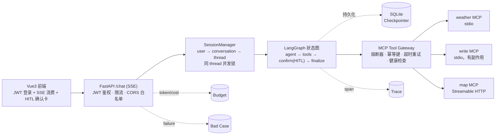

# MCP Multi-Tool Agent

   [](https://github.com/z8ri/mcp-multi-tool-agent/actions/workflows/ci.yml) [](LICENSE)

一个从零手写的 LangGraph 状态图（`agent` / `tools` / `confirm` / `finalize` 四个节点 + 条件边），前面接一个带熔断器、健康检查、幂等键、超时重试的 MCP Tool Gateway，支持多用户会话隔离、可从进程重启中恢复的对话状态，以及写文件这类有副作用操作的人工确认——HITL 通过 LangGraph 的 `interrupt()` 实现，图会在 `confirm` 节点暂停执行，等待一次 API 调用批准或拒绝后再继续。72 个自动化测试，`backend/app` 行覆盖率 94%，CI 在每次 push 上运行；该链路已用 Qwen API 完成端到端联调，细节见 [docs/ENGINEERING_NOTES.md](docs/ENGINEERING_NOTES.md)。

## 为什么这么设计

多工具 Agent 接进生产环境之前，有几个问题绕不开：

1. **写类工具调用如何保证审批环节真正生效，而不是一个不拦截任何操作的确认框？** `confirm` 节点通过 LangGraph 的 `interrupt()` 暂停图的执行——客户端提交 `confirm: true/false` 之前，写文件工具不会被调用；暂停状态落在 SQLite Checkpointer 里，进程重启也不会丢。
2. **一个 MCP Server 挂了，怎么不把其它工具也一起拖死？** 每个 Server 有独立的熔断器和健康检查，`/readyz` 按 Server 分别汇报状态。`map` 挂了的时候 `weather`/`write` 仍然正常可用——集成测试和 Docker 部署中均已验证。
3. **客户端重试同一个写请求，如何避免重复写入？** 幂等键存储记录每次写类工具调用的结果，第二次相同 key 的调用直接返回上次的结果（`idempotent_replay: true`），不会重新执行副作用。
4. **对话状态怎么在进程重启后还能续上，而不是纯内存丢了就丢了？** SqliteSaver Checkpointer 替换掉 LangGraph 默认的 `InMemorySaver`——包括 `confirm` 节点的暂停状态本身。
5. **怎么防止某个用户把模型账单跑到失控？** 后台按用户累计 token 花费，累计超过阈值时 `/chat` 在真正调用模型**之前**就用 402 拦住，不是等账单出来才后悔。
6. **怎么知道模型在生产里什么时候答得不好，而不是只盯着离线 eval 集？** Eval 跑失败的场景和线上 `/chat` 抛出的 error 写进同一张 Bad Case 表，`GET /bad-cases` 能直接查，不用翻日志现挖。

## 工作原理



`thread_id` 全程只存在于服务端（`SessionManager` 维护 `conversation_id → thread_id` 的映射），前端只知道 `conversation_id`，拿不到也改不了 LangGraph 的 thread 标识。写文件这类有副作用的工具调用会让图在 `confirm` 节点真正 `interrupt()`，客户端提交 `confirm: true/false` 之后才 `resume`——中间如果进程重启，SQLite Checkpointer 能把暂停状态原样恢复。

## 验证

| | |
|---|---|
| 单元 / 集成测试 | 72 个用例，`backend/app` 行覆盖率 94%（`pytest-cov`，`term-missing` 报告） |
| CI | 每次 push/PR 跑 pytest + 覆盖率 + Alembic `upgrade`/`downgrade` 校验 + 前端 `vue-tsc` 类型检查/`vite build`（[Actions](https://github.com/z8ri/mcp-multi-tool-agent/actions)） |
| Docker Compose | 三容器按健康检查顺序完成启动验证；`map.geocode` 返回 Nominatim 的坐标数据 |
| 模型联调 | 使用生产 `DASHSCOPE_API_KEY` 完成端到端验证：Qwen 流式推理 → 工具选择 → HITL 暂停/批准 → 文件写入 |
| E2E | Playwright 4 个场景，浏览器端到端驱动 |

具体怎么验证的、验证范围的边界在哪，见 [docs/ENGINEERING_NOTES.md](docs/ENGINEERING_NOTES.md)——其中也记录了实现过程中遇到的几个问题（MCP stdio 子进程不继承完整环境变量、aiosqlite 连接重复 await、Docker 里两个镜像解析出不同的 `mcp` 大版本、Alembic 自动生成代码漏了一行 import 等），以及第一版测试断言本身写错的一次复盘。

## 核心设计点

| 组件 | 解决什么问题 | 位置 | 测试 |
|---|---|---|---|
| 自定义 LangGraph 状态图 + SQLite Checkpointer | 不用预构建 `create_react_agent`；agent/tools/confirm(HITL)/finalize 四节点+条件边；`interrupt()` 暂停状态跨进程重启恢复 | `backend/app/agent/` | 2 端到端（暂停/批准/拒绝三条路径都覆盖） |
| MCP Tool Gateway | allowlist、超时重试、熔断器、健康检查、单 Server 故障隔离——一个 Server 挂了不清空整个工具列表 | `backend/app/mcp_gateway/` | 4（熔断器）+ 故障隔离验证 |
| 幂等键存储 | 写类工具调用去重，重复请求直接返回上次结果，不重新执行副作用 | `backend/app/mcp_gateway/idempotency.py` | 4 + 重复调用验证 |
| Weather / Write / Map MCP Server | 重试+缓存+结构化错误；路径沙箱+并发防覆盖；免 Key 地理编码（Streamable HTTP） | `mcp_servers/` | 7 + 6 + Docker 部署验证 |
| JWT 鉴权 + SessionManager | user→conversation→thread 映射；同 thread 并发请求用锁串行化；跨用户越权访问被拒绝 | `backend/app/auth/`, `backend/app/sessions/` | 10 + 5（含 `asyncio.gather` 并发验证） |
| SSE `/chat` + 分级错误 | 按图执行步骤增量推送；`error{code, retryable}` 分级而不是裸异常 | `backend/app/api/` | 7 + curl 端到端验证 |
| Trace / 成本预算 / Bad Case | 每次调用落一条 span；按用户累计花费，超预算 402 拦截；eval 失败场景与线上 error 共享同一张表 | `backend/app/trace/`, `budget/`, `badcases/` | 2 + 6 + 4 |
| 限流 + 日志脱敏 | 按用户令牌桶限流；`Authorization`/API Key 不会原样出现在日志里 | `backend/app/security/` | 5 + curl 验证脱敏 |
| Vue3 前端 | `conversation_id` 隔离、SSE 消费、HITL 确认卡、分级错误+重试 | `frontend/src/` | Playwright 4 + 浏览器手工验证 |

## 目录结构

```
backend/        FastAPI 应用、Agent Harness、MCP Gateway、鉴权、数据库模型
mcp_servers/    独立的 MCP Server 进程（weather / write / map）
frontend/       Vue3 前端
ops/            Docker Compose 与部署配置
docs/           实现状态、工程笔记
```

## 环境要求

- **Python 3.11+**（`mcp`、`langgraph-checkpoint-sqlite` 等依赖要求 3.10+）。
- **Node.js 18+**。

## 快速开始

```bash
conda create -n mcp-agent python=3.11
conda activate mcp-agent

pip install -r backend/requirements.txt
cp .env.example .env   # MOCK_MODE=true（默认值）时不需要填任何 Key

pytest   # 跑 backend/tests 和 mcp_servers/tests
```

`pytest.ini` 接了 `pytest-cov`，每次跑 `pytest` 都会带一份 `backend/app` 的行覆盖率报告；目前是 72 个用例、94% 行覆盖率（`mcp_servers/*` 是独立子进程，跨进程边界 coverage.py 量不到，不算在这个数字里）。

### 持续集成

`.github/workflows/ci.yml` 会在 push/PR 时跑一遍后端 `pytest`（含上面那份覆盖率报告）、Alembic 基线迁移的 upgrade/downgrade、前端 `vue-tsc` 类型检查 + `vite build`——都不需要真实 API Key，结果见仓库的 [Actions 页面](https://github.com/z8ri/mcp-multi-tool-agent/actions)。

### 起后端、用 mock 模式试一遍完整链路（不需要任何 API Key）

```bash
cd backend
uvicorn app.main:app --reload
```

另开一个终端：

```bash
# 注册并拿到 token
TOKEN=$(curl -s -X POST localhost:8000/auth/register \
  -H 'Content-Type: application/json' \
  -d '{"email":"me@example.com","password":"correct horse battery staple"}' | python3 -c 'import sys,json;print(json.load(sys.stdin)["access_token"])')

# 建一个会话
CONV_ID=$(curl -s -X POST localhost:8000/conversations \
  -H "Authorization: Bearer $TOKEN" -H 'Content-Type: application/json' \
  -d '{"title":"demo"}' | python3 -c 'import sys,json;print(json.load(sys.stdin)["id"])')

# 聊天（SSE），mock 模式下发"写"相关的话会触发写文件工具、需要走确认
curl -N -X POST localhost:8000/chat \
  -H "Authorization: Bearer $TOKEN" -H 'Content-Type: application/json' \
  -d "{\"conversation_id\": $CONV_ID, \"message\": \"帮我写一个笔记\"}"

# 上面那次会在 confirm_required 事件处结束；批准执行：
curl -N -X POST localhost:8000/chat \
  -H "Authorization: Bearer $TOKEN" -H 'Content-Type: application/json' \
  -d "{\"conversation_id\": $CONV_ID, \"confirm\": true}"
```

`MOCK_MODE=false` 并填好 `DASHSCOPE_API_KEY` 之后，同一套 API 会换成真实调用通义千问；天气/地图工具本身默认不需要额外 Key（地图走自建的 Nominatim Server，天气没配 `OPENWEATHER_API_KEY` 时会返回结构化的"未配置"错误而不是崩溃）。`QWEN_MODEL` 要填经典命名（默认值 `qwen-plus`）——阿里云百炼控制台"免费额度"页面里那些版本号式的模型名（比如 `qwen3.8-flash`）是给别的接口用的，直接填给这里会报 `400 InvalidParameter: url error`。该链路（Qwen 推理 + 工具调用 + HITL + 文件写入）已用生产 Key 验证，见 `docs/ENGINEERING_NOTES.md`。

### 查一次对话的 Trace

```bash
curl -s localhost:8000/conversations/$CONV_ID/trace -H "Authorization: Bearer $TOKEN" | python3 -m json.tool
```

### 查预算用量 / Bad Case

```bash
curl -s localhost:8000/budget -H "Authorization: Bearer $TOKEN" | python3 -m json.tool
curl -s localhost:8000/bad-cases -H "Authorization: Bearer $TOKEN" | python3 -m json.tool
```

### 跑 Eval 回归套件

```bash
cd backend
python -m eval.runner
```

## 前端

后端起好之后（见上面），另开一个终端：

```bash
cd frontend
npm install
cp .env.example .env   # VITE_API_BASE_URL 指向后端，默认 http://localhost:8000
npm run dev
```

浏览器打开 `http://localhost:5173`，注册一个账号，新建对话，跟它说"今天天气怎么样"或者"帮我写一个笔记"就能看到工具调用、HITL 确认卡、分级错误+重试这些效果。详见 [frontend/README.md](frontend/README.md)；端到端测试见 [frontend/e2e/README.md](frontend/e2e/README.md)。

## Docker 部署

一键起全栈（`map-mcp` + `backend` + `frontend`，`backend` 内部再拉起 `weather`/`write` 两个 stdio 子进程）：

```bash
cp .env.example .env   # MOCK_MODE=true 不需要填任何 Key
docker compose -f ops/docker-compose.yml up --build
```

起来之后：前端 `http://localhost:5173`，后端 `http://localhost:8000`，地图 MCP Server（Streamable HTTP）`http://localhost:8811/mcp`。`backend` 会等 `map-mcp` 健康检查通过、`frontend` 会等 `backend` 健康检查通过才启动，验证的是"单 Server 故障不拖垮整体"这条在容器编排层面也成立。

`backend-data`/`backend-output` 是具名 volume，装的是 SQLite 数据库文件和 `write_file` 落盘的内容，`docker compose down` 不会删，`docker compose down -v` 才会。

`docker compose up -d --build` 已验证通过：三个容器按顺序变 healthy，`/readyz` 里 `map`/`weather`/`write` 三个工具都可用，`map.geocode` 返回了 Nominatim 的数据，前端也成功连接到容器内的后端。过程中修了两个只有在干净容器里从头构建才会暴露的问题：`mcp` 包在两个镜像里解析出了不同的大版本、以及 map-mcp 的健康检查一开始把 Streamable HTTP 端点对 406 的正常响应误判成"挂了"——都已经修好，细节见 `docs/ENGINEERING_NOTES.md`。

## 数据库 Schema 迁移

业务库（`User`/`Conversation`，`backend/app/db/models.py`）用 [Alembic](https://alembic.sqlalchemy.org/) 管理版本化迁移，起服务时仍然是 `SQLModel.metadata.create_all()`（图快，见 `db/engine.py` 的 `init_db()`），但**改已有表结构**（加字段、改约束）应该走 Alembic，而不是直接改 `models.py` 指望 `create_all` 把已有数据库也改对——`create_all` 只会建"不存在的表"，不会给已有表加新列。

```bash
cd backend
python -m alembic upgrade head       # 应用所有迁移到 DATABASE_URL 指向的库
python -m alembic revision --autogenerate -m "描述这次改了什么"   # 改完 models.py 后生成新迁移
```

**范围边界**：`idempotency_keys`/`trace_spans`/`budget_usage`/`bad_cases` 这几张表不归 Alembic 管——它们各自是独立 SQLite 文件里的单表日志/缓存，用裸 `CREATE TABLE IF NOT EXISTS` 建表，只增不改列，这个机制本身就够用；接进 Alembic 反而是过度设计。

## 数据保留

`trace_spans` 每次模型/工具调用都落一条，长期跑会无限增长；`idempotency_keys` 有 TTL 但原来是懒惰过期（没人查的过期 key 会一直留着）；`bad_cases` 里已经标记"已处理"的旧记录也没有清理机制。现在服务**每次启动时**会主动清一次：过期的幂等键、超过 `TRACE_RETENTION_DAYS`（默认 30 天）的 trace span、已处理超过 30 天的 bad case。没有引入额外的定时任务框架——这个粒度对这个项目的规模够用，真要 7x24 常驻部署应该换成独立的定时任务，而不是"重启时才清一次"。

## License

[MIT](LICENSE)
